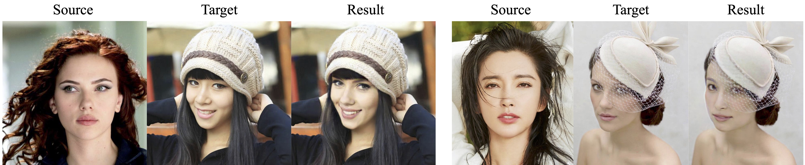
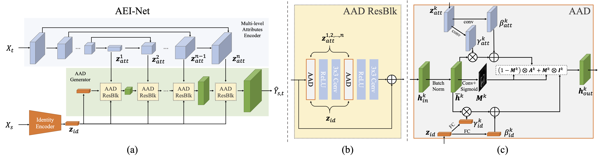
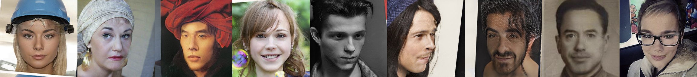

# FaceShifter &mdash; Unofficial PyTorch Implementation


         

Unofficial Implementation of [FaceShifter: Towards High Fidelity And Occlusion Aware Face Swapping](https://arxiv.org/abs/1912.13457) with [Pytorch-Lightning](https://github.com/PyTorchLightning/pytorch-lightning).
In the paper, there are two networks for full pipe-line, AEI-Net and HEAR-Net. We only implement the AEI-Net, which is main network for face swapping.

## Datasets

### Preparing Data

You need to download and unzip:
- [FFHQ](https://github.com/NVlabs/ffhq-dataset) 
- CelebA-HQ ([Unofficial Download Script](https://github.com/suvojit-0x55aa/celebA-HQ-dataset-download))
- VGGFace ([Unofficial Download Script](https://github.com/ndaidong/vgg-faces-utils))

### Preprocess Data
Preprocessing code is mainly based on [Nvidia's FFHQ preprocessing code](https://github.com/NVlabs/ffhq-dataset/blob/bb67086731d3bd70bc58ebee243880403726197a/download_ffhq.py#L259-L349).
You may modify our [preprocess](./preprocess) with multi-processing functions to finish pre-processing step much faster.
```bash
# build docker image from Dockerfile
docker build -t dlib:0.0 ./preprocess
# run docker container from image
docker run -itd --ipc host -v /PATH_TO_THIS_FOLDER/preprocess:/workspace -v /PATH_TO_THE_DATA:/DATA -v /PATH_TO_SAVE_DATASET:/RESULT --name dlib --tag dlib:0.0
# attach
docker attach dlib
# preprocess with dlib
python preprocess.py --root /DATA --output_dir /RESULT
```

## Training
### Configuration
There is `yaml` file in the [`config`](./config) folder.
They **must** be edited to match your training requirements (dataset, metadata, etc.).

- [`config/train.yaml`](./config/train.yaml): Configs for training AEI-Net.
  - Fill in the blanks of: `dataset_dir`, `valset_dir`
  - You may want to change: `batch_size` for GPUs other than 32GB V100, or `chkpt_dir` to save checkpoints in other disk.
  
### Using Docker
We provide a Dockerfile for easier training environment setup.
```bash
docker build -t faceshifter:0.0 .
docker run -itd --ipc host --gpus all -v /PATH_TO_THIS_FOLDER:/workspace -v /PATH_TO_DATASET:/DATA --name FS --tag faceshifter:0.0
docker attach FS
```

### Pre-trained Arcface
During the training process, pre-trained [Arcface](https://openaccess.thecvf.com/content_CVPR_2019/html/Deng_ArcFace_Additive_Angular_Margin_Loss_for_Deep_Face_Recognition_CVPR_2019_paper.html)
is required. We provide our pre-trained Arcface model; you can download at [this](https://drive.google.com/file/d/1TAb6WNfusbL2Iv3tfRCpMXimZE9tnSUn/view?usp=sharing) link

### Command
To train the AEI-Net, run this command:

```bash
python aei_trainer.py -c <path_to_config_yaml> -g <gpus> -n <run_name>
# example command that might help you understand the arguments:
# train from scratch with name "my_runname"
python aei_trainer.py -c config/train.yaml -g 0 -n my_runname
```

Optionally, you can resume the training from previously saved checkpoint by adding `-p <checkpoint_path>` argument.

### Monitoring via Tensorboard

The progress of training with loss values and validation output can be monitored with Tensorboard.
By default, the logs will be stored at `log`, which can be modified by editing `log.log_dir` parameter at config yaml file.

```bash
tensorboard --log_dir log --bind_all # Scalars, Images, Hparams, Projector will be shown.
```

## Inference
To inference the AEI-Net, run this command:
```bash
python aei_inference.py --checkpoint_path <path_to_pre_trained_file> --target_image <path_to_target_image_file> --source_image <path_to_source_image_file> --output_path <path_to_output_image_file> --gpu_num <number of gpu>
# example command that might help you understand the arguments:
# train from scratch with name "my_runname"
python aei_inference.py --checkpoint_path chkpt/my_runname/epoch=0.ckpt --target_image target.png --source_image source.png --output_path output.png --gpu_num 0
```

We probived [colab example](https://colab.research.google.com/drive/1M99jX_nhZ74j_jdYIDtTvDKEE-XVoQnn?usp=sharing). You can use it with your own trained weight. 

## Results


### Comparison with results from original paper
#### Figure in the original paper

#### Our Results


Reminds you that we __only implement the AEI-Net,__ and the results in the original paper were generated by AEI-Net and HEAR-Net.

We will soon release the FaceShifter in our cloud API service, [maum.ai](https://maum.ai/?lang=en)

## License

[BSD 3-Clause License](https://opensource.org/licenses/BSD-3-Clause).

## Implementation Author

Changho Choi @ MINDs Lab, Inc. (changho@mindslab.ai)

## Paper Information

```bibtex
@article{li2019faceshifter,
  title={Faceshifter: Towards high fidelity and occlusion aware face swapping},
  author={Li, Lingzhi and Bao, Jianmin and Yang, Hao and Chen, Dong and Wen, Fang},
  journal={arXiv preprint arXiv:1912.13457},
  year={2019}
}
```